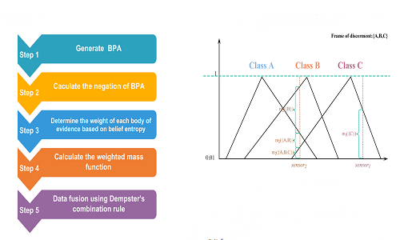








Wu Dongdong (吴东冬) is currently a first-year M.Eng. student in [School of computer science and engineering at Southeast University](https://cse.seu.edu.cn/). He is a member of [Pattern Learning and Mining Lab (PALM)](http://palm.seu.edu.cn/) supervised by [Prof. Min-Ling Zhang](http://palm.seu.edu.cn/zhangml/). Wu Dongdong received his B.Eng. degree in [School of Big Data & Software Engineering at Chongqing University](http://www.cse.cqu.edu.cn/) in Jun 2021. In the same year, he was admitted to study for an M.Eng. degree in Southeast University without entrance examination.

My research interest includes **machine learning and data mining**. Specially now I am focusing on **partial label learning** and **noisy label learning**.

# 🔥 News
- None

# 📝 Publications 

[A new classification method based on the negation of a basic probability assignment in the evidence theory](https://www.sciencedirect.com/science/article/abs/pii/S0952197620302864), **Dongdong Wu**, Zijing Liu, Yongchuan Tang\*

**EAAI, 2020** \| [**Project**](https://scholar.google.com/citations?view_op=view_citation&hl=zh-CN&user=_Vx3dZgAAAAJ&citation_for_view=_Vx3dZgAAAAJ:9yKSN-GCB0IC) <strong></strong>
- In this paper, in the frame of Dempster–Shafer evidence theory, a new classification method based on the negation of basic probability assignment (BPA) is proposed to implement an effective classification. The proposed method addresses the issue that the values of samples’ attributes cannot clearly point out a certain class in classification problems. 

- [A new approach for generation of generalized basic probability  assignment in the evidence theory]([A new approach for generation of generalized basic probability assignment in the evidence theory (springer.com)](https://link.springer.com/content/pdf/10.1007/s10044-021-00966-0.pdf)), Yongchuan Tang\*, **Dongdong Wu**, Zijing Liu, **PAA 2020**
- [An improved failure mode and effects analysis method based on uncertainty measure in the evidence theory](https://onlinelibrary.wiley.com/doi/epdf/10.1002/qre.2660), **Dongdong Wu**, Yongchuan Tang*, **QRE 2020**

# 🎖 Honors and Awards
- *2021.10* Lorem ipsum dolor sit amet, consectetur adipiscing elit. Vivamus ornare aliquet ipsum, ac tempus justo dapibus sit amet. 
- *2021.09* Lorem ipsum dolor sit amet, consectetur adipiscing elit. Vivamus ornare aliquet ipsum, ac tempus justo dapibus sit amet. 

# 📖 Educations
- *2019.06 - 2022.04 (now)*, Lorem ipsum dolor sit amet, consectetur adipiscing elit. Vivamus ornare aliquet ipsum, ac tempus justo dapibus sit amet. 
- *2015.09 - 2019.06*, Lorem ipsum dolor sit amet, consectetur adipiscing elit. Vivamus ornare aliquet ipsum, ac tempus justo dapibus sit amet. 

# 💬 Invited Talks
- *2021.06*, Lorem ipsum dolor sit amet, consectetur adipiscing elit. Vivamus ornare aliquet ipsum, ac tempus justo dapibus sit amet. 
- *2021.03*, Lorem ipsum dolor sit amet, consectetur adipiscing elit. Vivamus ornare aliquet ipsum, ac tempus justo dapibus sit amet.  \| [\[video\]](https://github.com/)

# 💻 Internships
- *2019.05 - 2020.02*, [Lorem](https://github.com/), China.
