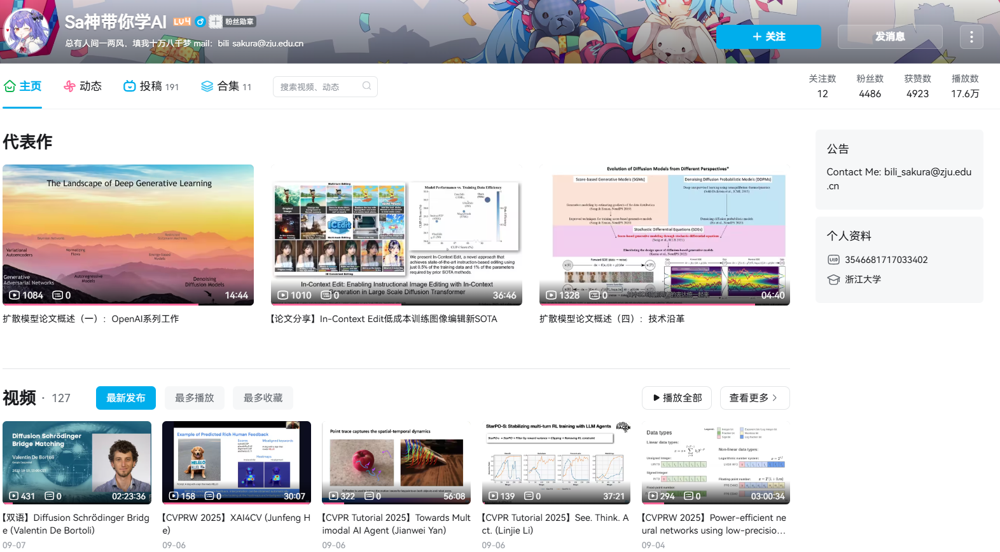

## About Me

I am a first-year Ph.D. student at <a href="http://www.u-tokyo.ac.jp/en/" style="text-decoration: none;">the University of Tokyo</a>,  supervised by Prof. <a href="http://www.ms.k.u-tokyo.ac.jp/sugi/index.html" style="text-decoration: none;">Masashi Sugiyama</a>. I am also a Junior Research Associate at the <a href="https://aip.riken.jp/labs/generic_tech/imperfect_inf_learn" style="text-decoration: none;">Imperfect Information Learning Team</a>, <a href="https://www.riken.jp/en" style="text-decoration: none;">RIKEN</a> <a href="https://aip.riken.jp/" style="text-decoration: none;">Center for Advanced Intelligence Project</a>. Before that, I received my M.Eng. degree from <a href="https://cse.seu.edu.cn/" style="text-decoration: none;">Southeast University</a> under the supervision of Prof. <a href="http://palm.seu.edu.cn/zhangml" style="text-decoration: none;">Min-Ling Zhang</a>. I received my B.Eng. degree from <a href="http://www.cse.cqu.edu.cn/" style="text-decoration: none;">Chongqing University</a>. During my research journey, I also had wonderful time at MBZUAI, Ant Group and CASIA.

## Research Interests

My research interests include the application of multimodal large language models and diffusion models in remote sensing.

<strong>📺 Bilibili & Other Projects</strong>

## Bilibili

## Other Projects

### My Collaborations

- [@paper2slides](https://github.com/takashiishida/paper2slides)  
  Transform any arXiv papers into slides using LLMs.

### My Projects

- [@coding-diffusers-from-scratch](https://github.com/Bili-Sakura/coding-diffusers-from-scratch)  
  A simple implement of huggingface/diffusers for image generation.

- [@lilianweng.github.io-fork](https://github.com/Bili-Sakura/lilianweng.github.io-fork)  
  Fork of lilianweng personal person for adding pdf version of blogs.

- [@NeurIPS-Ariel-Data-Challenge-2025-Silver-Solution](https://github.com/Bili-Sakura/NeurIPS-Ariel-Data-Challenge-2025-Silver-Solution)  
  A silver solution (29th, top 3%) for NeurIPS - Ariel Data Challenge 2025. Technical report forthcoming. Team: Sakura (Adviser); Simon (Major Contributor); Larry (Project Leader, Contributor); Phi (Contributor); AT (Contributor). Acknowledgements: Thanks to high-level guidance from student member Dr. Xiu Yuan and Prof. Cheng Su.

- [@NeurIPS-Ariel-Data-Challenge-2024](https://github.com/Bili-Sakura/NeurIPS-Ariel-Data-Challenge-2024)  
  Tutorials: NeurIPS - Ariel Data Challenge 2024.

### Teaching Assistant

These are short-term courses for 3rd-year college students at Zhejiang University, where I serve as a teaching assistant (TA).

- [ZJU-GISLAB-COURSE-2025-Data-Augmentation](https://github.com/Bili-Sakura/ZJU-GISLAB-COURSE-2025-Data-Augmentation)  
  Remote Sensing Data Augmentation for Building Damage Extraction

- [ZJU-GISLAB-COURSE-2024](https://github.com/Bili-Sakura/ZJU-GISLAB-COURSE-2024)  
  A naive try for using diffusion model in remote sensing generation.

## News

- **[Sep. 2025]** 🎉 We achieved a silver medal (29th, top 3%) in NeurIPS - Ariel Data Challenge 2025; technical report forthcoming. Repo: [NeurIPS-Ariel-Data-Challenge-2025](https://github.com/Machine-Unlearning-Team/NeurIPS-Ariel-Data-Challenge-2025)

- **[Sep. 2025]** Our paper "RSCC: A Large-Scale Remote Sensing Change Caption Dataset for Disaster Events" is accepted as a poster at NeurIPS 2025 Datasets and Benchmarks Track.



<!--  -->
